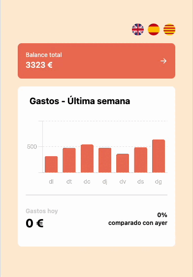

# Inprocode

Inprocode is a simple app that allows you to track your daily expenses displayed in a chart. You can also view the total amount spent during the week and the difference in expenses between the current day and the previous day.

By clicking the arrow button, you can navigate to the next or previous week's data.
Additionally, you have the option to switch the language to Catalan, Spanish or English.

This app uses varios dependencies such as Chart.js for displaying charts, i18n for implementing multilingual support, and SonarCloud for improving code quality.

Try it out for yourself [here](https://inprocode-chart.vercel.app/)!

## Here you can see a demo of what you can find:

## Built with:

## Roadmap

Upcoming features planned for this project include:

- Adding more tests.
- Improving SOLID principles.
- Resetting the color of the blue chart bar when switching weeks.

## Contributions:

Contributions are welcome & appreciated from everyone!

If you would like to contribute, please follow these steps:

1\. Fork the repository.  
 2\. Create a branch for your changes.  
 3\. Make your changes.  
 4\. Test your changes.  
 5\. Commit your changes.  
 6\. Push your changes to your fork.  
 7\. Open a pull request.

## Authors

- [@mllenas12](https://www.github.com/mllenas12)
